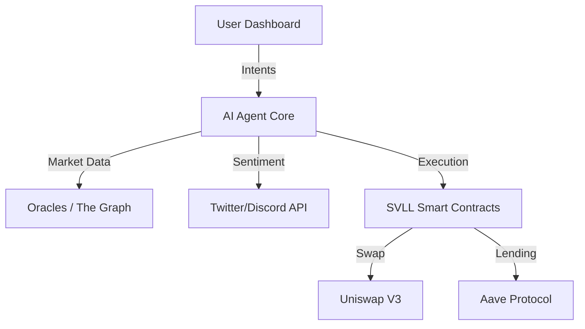

# 🧠 SVLL: Sovereign AI Crypto Assistant

[](https://opensource.org/licenses/MIT)
[](https://etherscan.io/)
[](https://github.com/MSSATANASS/SVLL-CRYPTO-ASISST-AI)

**SVLL (Sovereign Voice Low Latency)** is a decentralized, AI-powered crypto trading assistant designed to operate autonomously on EVM-compatible blockchains. It leverages Large Language Models (LLMs) to analyze market sentiment, execute trades via smart contracts, and manage portfolios with self-custody principles.

---

## 🚀 Key Features

### 🤖 Autonomous Trading Agent

- **Sentiment Analysis:** Real-time processing of Twitter/X, Discord, and News data using local LLMs.
- **Pattern Recognition:** Technical analysis (RSI, MACD, Bollinger Bands) automated execution.
- **Sniper Mode:** Mempool monitoring for new token launches (0-block execution).

### 🔒 Privacy & Security

- **Self-Custody:** Non-custodial architecture. You hold your keys locally.
- **TEE Execution:** Critical agent logic runs inside Trusted Execution Environments (TEEs) for tamper-proof operation.
- **On-Chain Verification:** All agent actions are verifiable on-chain via zk-SNARK proofs.

### ⚡ Technical Stack

- **AI Core:** Llama-3-70B (Quantized) / Mixtral 8x7B
- **Framework:** LangChain + Custom Agentic Logic
- **Blockchain:** Solidity (Smart Contracts) + Web3.js / Ethers.js
- **Indexing:** The Graph Protocol
- **Infrastructure:** Docker, Kubernetes, AWS Nitro Enclaves

---

## 🏗️ Architecture



## 📦 Modules

### `/ai-agent`

Contains the Python/Torch logic for the autonomous agent, including LoRA adapters for financial sentiment fine-tuning.

### `/contract`

Solidity smart contracts for the **SVLL Vault** and **Executor**, optimized for gas efficiency (Yul assembly used in critical paths).

### `/frontend`

Next.js + TailwindCSS dashboard for portfolio visualization and agent configuration.

---

## 🛠️ Quick Start (Developer Preview)

1. **Clone the repository**

```bash
git clone https://github.com/MSSATANASS/SVLL-CRYPTO-ASISST-AI.git
cd SVLL-CRYPTO-ASISST-AI
```

1. **Install dependencies**

```bash
npm install
# or
pnpm install
```

1. **Configure Environment**
Create a `.env` file with your RPC endpoints and API keys:

```env
ETH_RPC_URL=https://eth-mainnet.g.alchemy.com/v2/...
OPENAI_API_KEY=sk-...
```

1. **Run Local Node**

```bash
npm run node:local
```

---

## 🛣️ Roadmap

- [x] **Phase 1:** Core Agent Logic & Sentiment Analysis
- [x] **Phase 2:** Smart Contract Audits & Testnet Deployment
- [ ] **Phase 3:** Mainnet Launch (Q3 2026)
- [ ] **Phase 4:** DAO Governance Implementation

---

## 🤝 Contributing

We welcome contributions from the community. Please check `CONTRIBUTING.md` for guidelines on how to submit PRs.

## 📄 License

This project is licensed under the MIT License - see the `LICENSE` file for details.

---

**Built with ❤️ for the Decentralized Future.**
